# Mapping Tools

Creating a map has gotten a lot more simpler since the older map tutorial videos. There is no longer a need to use external tools (i.e Blender, RPG Maker, Pokémon Essentials, etc) as the map creation and compilation process is done entirely within Unity's Editor.

In fact, I created a macro to demonstrate the map editor tools and their capabilities:

<video width="480" height="270"  controls="true" allowfullscreen="true">
    <source src="assets/articles/mapcreation/macro.webm" type="video/webm">
</video>

!> You can still create maps using the [legacy method](https://www.youtube.com/c/IIcolourSpectrum/videos) as the terrain tag system is still supported.

## Getting Started

When starting a new map, the first thing you will need to do is use the pre-made base scene.

It is provided to ensure full compatibility and to provide all of the necessary objects instead of starting from scratch:

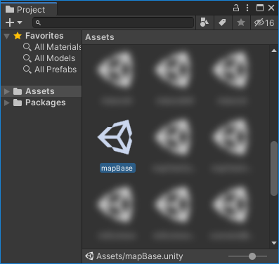

At this point it is recommended to save the scene as a different name to avoid overwriting the base map.

After initializing the base map scene, to start on creating a map you will need to right click the scripted tools icon and select the "Tile Editor" tool:

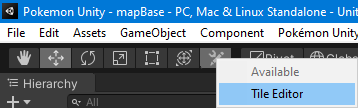

After selecting the "Tile Editor" tool, the best way to use the mapping scripts would be to enable the "Map Editor" window:

(It is also suggested to set up "Auto Snap" to snap tiles to the grid by 1 unit)

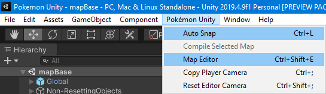

It would be wise to dock the new window(s) to something easily accessible, like the side of the "Scene" window:

(You can dock windows by clicking and dragging on the navigation bar at the top of the window, not the title bar)

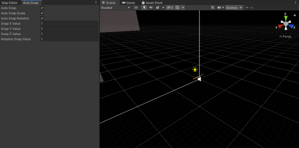

Now would be a good time to enable the map editor grid using the first button in the docked window:

At this point, the environment is set up to start creating maps.

!> You can skip the "Map Editor" and "Auto Snap" windows if necessary, they are not required.

## Creating a Basic Map

To start creating a map, you will first need to create the root map object:

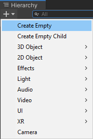

Give it a name, make sure it is at position 0X, 0Y, 0Z, add the components "MapSettings" and "MapCollider", and set its layer to "VisibleLocked":

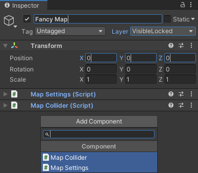

While selecting the map, now would be a good time to set the settings for it:

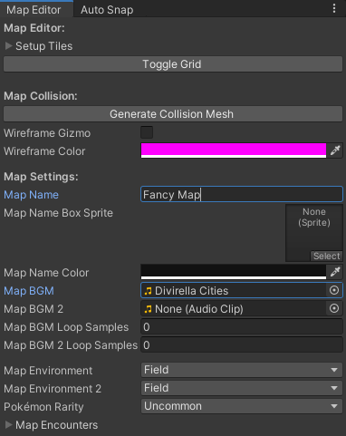

Here are what these settings mean:

- Map Name
    - The name displayed when the map is entered or being saved.
- Map Name Box Sprite
    - The sprite used as the background to the map's title.
        - Not implemented, setting this will result in an error at this time.
- Map BGM
    - The day time (or only) music that is played while in the map.
- Map BGM 2
    - The night time music that is played while in the map.
        - Untested
- Map Environment
    - If a Pokémon battle takes place within the map, this will be the background environment
        - Untested
- Map Environment 2
    - Same as above, but for subenvironments when using the legacy terrain tag system.
        - Untested
- Pokémon Rarity
    - How rare finding a Pokémon would be in grass patches.
        - Untested
- Map Encounters
    - What Pokémon can be found in the wild (grass).
        - Untested

After setting these parameters, this map has been set up with the basic elements for now.

!> In the future you can set a parent GameObject to this map for better organization with objects, footsteps, effects, and events. For a simple map such as this one, it is not required.

To add a tile, head into Assets/MapCreation:

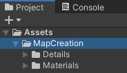

From here, there would be a lot of different tiles that would be used in the future. These are the most useful at this time:

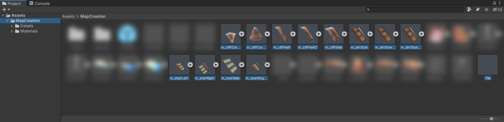

Drag and drop a tile into the map GameObject:

(For instance, the "Tile" prefab)

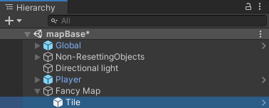

At this point, the tile should appear in the center of the scene. If not, make sure the parent GameObject is at position 0X, 0Y, 0Z.

!> Be warned however, as the "Map Editor" window cannot currently process multiple tile selections. You can still manipulate multiple tiles outside of the window though.

Press **0** on the numpad or the **L** key in the Scene view to reset your view relative to the player's camera:

(If this does not function, select the "Tile Editor" tool and try again)

!> This will reset the current camera parameters!

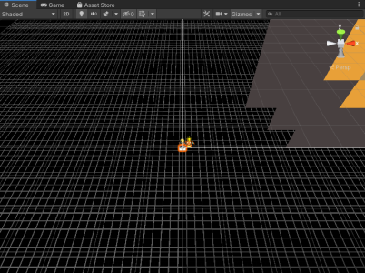

To enter the Map Editor camera in a perspective mode, press **5** on the numpad or the **P** key:

(To enter an orthographic mode, press **5** on the numpad or **P** once again.)

To view the scene at a top-down perspective, press **\***:

(In combination with the orthographic mode, this would be reminiscent of a tile editor)

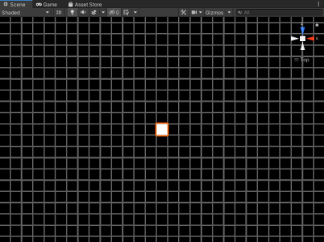

While selecting the tile, you can move it using **8 2**↕, **4 6**↔, **＋ —**↨.

(**8** and **2** move the tile vertically, **4** and **6** move the tile horizontally, **＋** and **—** ascend/descend the tile)

Here is a GIF explaining the different keys:

<image width="480" height="270" src="assets/articles/mapcreation/moving-a-tile.gif">

!> It is also possible to click and drag the tile to move it, though you can't ascend or descend the tile this way.

Rotating a tile can be done using **\\** on the numpad or the **SPACE** key:

<image width="480" height="270" src="assets/articles/mapcreation/rotating-a-tile.gif">

To duplicate tiles, the shortcut key **CTRL+D** is useful in this sense. You can power though creating maps using the number pad and this shortcut combined.

After creating your map, select any tile within it and click "Generate Collision Mesh" within the "Map Editor" window:

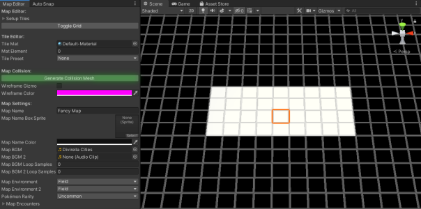

This will generate a mesh using all of the tiles within the map that will be used for collision purposes.

To view the collision mesh while editing a map, toggle the "Wireframe Gizmo" option in the "Map Collision" of the "Map Editor" window and enable gizmos:

(You may need to click onto the root map GameObject once again or reset the camera multiple times before the collision gizmo appears)

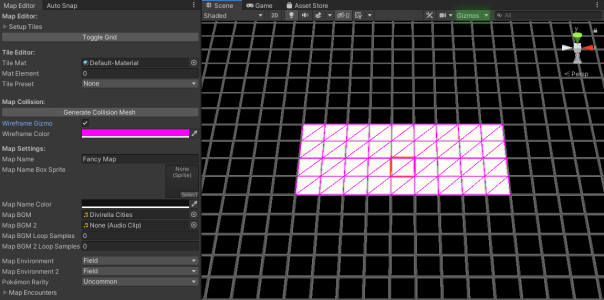

## Playing a Map

At this point, you can play the map using the play button at the top of the Unity window.

If you turned on the grid, you may have noticed that it is visible while in play mode. This can be fixed by toggling the grid once more before playing:

The map should now work as-is.

Do not worry if you can move outside of the map's boundaries, this is currently possible as there is no mesh preventing the player from moving outside (i.e cliffsides or walls).

!> Don't forget to add the new scene to your build settings if you intend to build the framework with this map!

## Advanced Mapping

This section is TBD.
